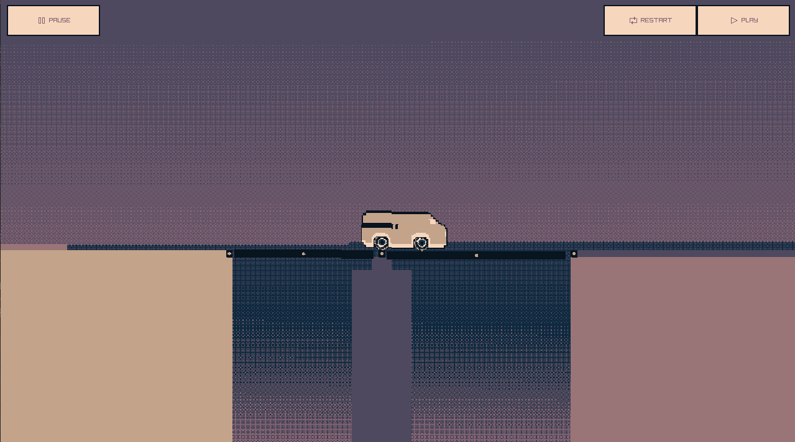
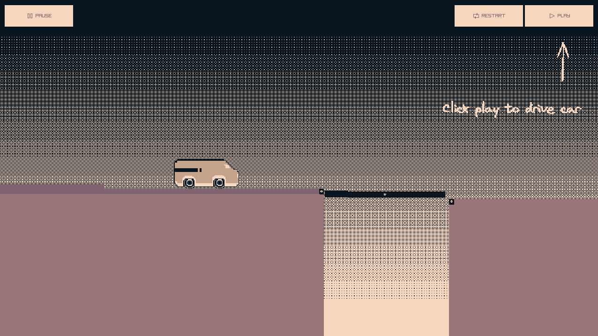
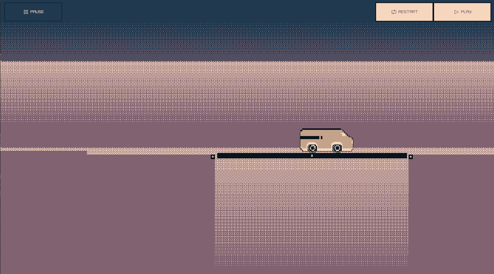
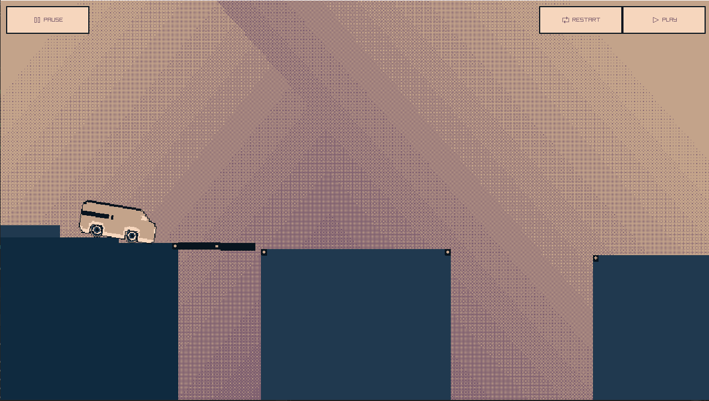

## Next Bridge

### Description
 Game for Raylib NEXT gamejam. Developed with raylib for web and win builds

### Libs
 - Raylib [link](https://github.com/raysan5/raylib)
 - box2d [link](https://github.com/erincatto/box2d)

### Assets
 - Palette - [link](https://lospec.com/palette-list/nyx8)
 - Sound car effect [link](https://freesound.org/people/qubodup/sounds/147242/)
 - All music and sound effects written by myself

### Links
 - Gameplay: [Youtube](https://youtu.be/gfJgkwLhSo8)
 - itch.io Release: [Play](https://raizr.itch.io/nextbridge)

### License
This game sources are licensed under an unmodified zlib/libpng license, which is an OSI-certified, BSD-like license that allows static linking with closed source software. Check [LICENSE](LICENSE) for further details.

*Copyright (c) (2024) (raizr) (Denis Pavlenko)*
